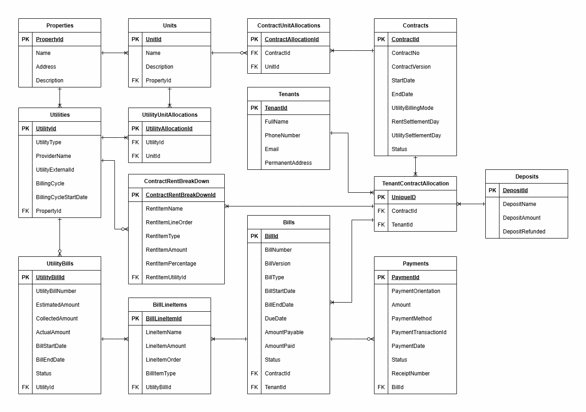

# 📊 Rentlify ERD Documentation

This document explains the **Entity Relationship Diagram (ERD)** for **Rentlify**, a rental management platform.  
The ERD defines the data model for managing **properties, tenants, contracts, utilities, bills, deposits, and payments**.

---

## 🏠 Core Entities

### 1. Properties
- Represents a property owned by landlord
- **PropertyId (PK)** uniquely identifies each property.
- Stores **name, address, and description**.
- A property can contain multiple **units** and **utilities**.

### 2. Units
- Represents any rentable unit in a property. (eg - room, flat, floor etc)
- **UnitId (PK)** uniquely identifies a rental unit within a property.
- Linked to **PropertyId (FK)**.
- A unit can be allocated to **contracts** and associated with **utilities**.

---

## 🔌 Utilities

### 3. Utilities
- Represent a utility that can be billed based on consumption
- **UtilityId (PK)** uniquely identifies a utility (e.g., electricity, water, internet).
- Stores **provider, billing cycle, and external reference ID**.
- Linked to **Properties**.

### 4. UtilityUnitAllocations
- Links **utilities to units** (e.g., electricity assigned to a flat).

### 5. UtilityBills
- Represent the bill generated for untility. Used to calculate variable component of rent.
- **status** can be **generated**, **estimated**, **cancelled**
- Stores generated **utility bills** with **amounts, cycle dates, and status**.
- Linked to `Utilities`.

---

## 👥 Tenant & Contracts

### 6. Tenants
- Represents any person or entity renting out one or many **unit**.
- **TenantId (PK)** uniquely identifies a tenant.
- Stores **full name, contact details, and permanent address**.
- Tenants are linked to **contracts** via `TenantContractAllocation`.

### 7. Contracts
- Represent a legal contract made between **tenent(s)** and landlord to rent out **unit(s)**.
- **status** can be **active**, **expired**, **cancelled**, **expired**
- **utility billing mode** can be **seperate**, **roll_over**, **estimated**. It defines how the utility bill should be adjusted for in case of different rent and utility billing cycle.
- **ContractId (PK)** uniquely identifies each contract.
- Tracks **start/end dates, contract version, billing modes, rent & utility settlement days, and status**.
- Defines rules for **rent and utility billing**.

### 8. ContractUnitAllocations
- Resolves **many-to-many relationship** between `Contracts` and `Units`.
- Ensures flexibility: one contract may cover multiple units, and one unit can be linked to different contracts over time.

### 9. TenantContractAllocation
- Resolves **many-to-many relationship** between `Tenants` and `Contracts`.
- Each allocation has a **UniqueID (PK)**.
- Tracks which tenants belong to which contracts.

### 10. ContractRentBreakDown
- Defines **detailed rent structure** per contract.
- **rent item type** can be **fixed**, **variable**
- variable rents compoennt are linked to **utility**
- Includes **line items, amounts, percentages, and allocation to utilities**.

### 11. Deposits
- Represents and stores the Deposit breakdown collected by the landlord.
- **DepositId (PK)** uniquely identifies a deposit.
- Stores **deposit name, amount, and refund status**.
- Can be used for **security deposits or advance payments**.

---

## 💳 Billing

### 12. Bills
- Represents all type bill aginst which payment are made by the tenent to landlord (e.g. Rent, Utiltiy, Maintainance, Deposits), or landlord to tenent (e.g. Utility Adjustment, Deposit Refund)
- **BillId (PK)** uniquely identifies a tenant bill.
- **bill status** can be **generate**, **cancelled**, **in review**
- Tracks **bill number, type, start/end dates, due dates, payable amount, and status**.
- Linked to **Contracts** and **Tenants**.

### 13. BillLineItems
- Breaks down **utility bills** into line items.
- Supports detailed tracking for estimation, collection, and adjustments.

### 14. Payments
- Represent the actual transfer of money between the 2 parties.
- **status** can be **paid**, **cancelled**
- **PaymentId (PK)** uniquely identifies a payment transaction.
- Tracks **amount, method, transaction ID, receipt number, and status**.
- Linked to **Bills**.

---

## 📌 ERD Diagram

---

## ⚡ Key Design Decisions

1. **Flexibility in Contracts**:  
   - Supports multiple tenants per contract.  
   - Allows allocation of multiple units under one contract.

2. **Detailed Billing**:  
   - Separate handling of **rent bills** and **utility bills**.  
   - Bill line items ensure **transparency** in calculations.

3. **Deposit Handling**:  
   - Deposits tracked independently from rent/utility bills.  
   - Supports refunds and advance settlements.

4. **Scalable Utility Billing**:  
   - Utility cycle independent of rent cycle.  
   - Supports carry-forward and adjustments.

---

## 🚀 Why This Matters

The ERD is designed to handle **real-world rental complexities**:
- Multiple tenants sharing a contract.
- Separate tracking of rent and utility costs.
- Flexible billing cycles and adjustments.
- Transparent deposits and refunds.
- Robust payments and reconciliation.

This schema ensures **scalability, flexibility, and clarity** for landlords, tenants, and property managers.

---