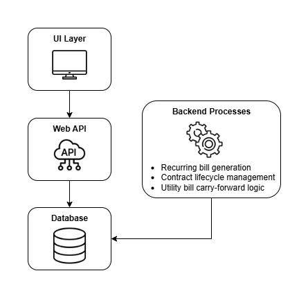

# 🏠 Rentify - test

**Rentify** is a platform designed to help landlords and property managers handle rental operations with ease.  
It provides a streamlined way to manage **properties, tenants, contracts, utilities, billing, and payments** in a single system.

---

## ✨ Features

### 🔑 Core Modules
- **Properties & Units**
  - CRUD operations for properties and rental units
- **Tenants**
  - Tenant onboarding, updates, and offboarding
- **Utilities**
  - CRUD operations for utilities associated with properties/units

### 📜 Contracts
- Create, cancel, or amend rental contracts
- Support for contract amendments (implemented as cancel + create)
- Add contract components (e.g., recurring charges, utilities) for billing

### 💳 Billing
- Generate bills (recurring & one-time)
- Review, cancel, or amend bills
- Support for cycle-based billing

### ⚡ Utility Bills
- Create and cancel utility bills
- Associate with tenants/contracts for accurate settlement

### 💵 Payments
- Record incoming payments
- Cancel / adjust payment entries
- Support reconciliation with bills

---

## 🏗️ Architecture

Rentify is built with modular components to support scalability and flexibility:

- **UI Layer**  
  User-friendly interface for landlords and tenants (planned as a web-based dashboard)

- **Web API**  
  Exposes core functionality for UI and integrations

- **Backend Processes**  
  Handles background jobs such as:
  - Recurring bill generation
  - Contract lifecycle management
  - Utility bill carry-forward logic

- **Database**  
  Centralized persistence layer to manage:
  - Properties, units, tenants
  - Contracts and billing cycles
  - Payments and utility data

---

## 🚀 Tech Stack (Proposed)

- **Frontend**: Angular
- **Backend**: .NET Core Web API
- **Database**: SQL Server
- **Background Jobs**: Hangfire / Quartz.NET
- **Authentication**: IdentityServer / JWT-based auth
- **Deployment**: Docker + Kubernetes (future scope)

---

## 📌 Roadmap

- [ ] Property & Tenant CRUD  
- [ ] Contract Management (create, cancel, amend)  
- [ ] Billing engine (generate, cancel, amend)  
- [ ] Utility Bill handling  
- [ ] Payment recording & reconciliation  
- [ ] Role-based access control (landlord, tenant, admin)  
- [ ] Reports & dashboards 
